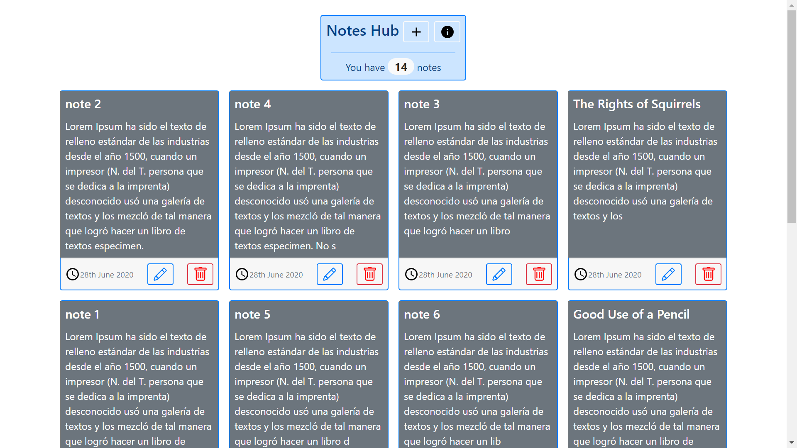
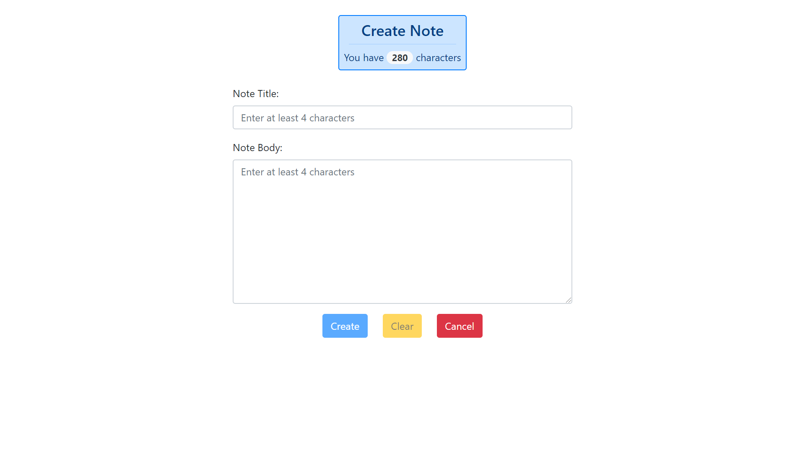
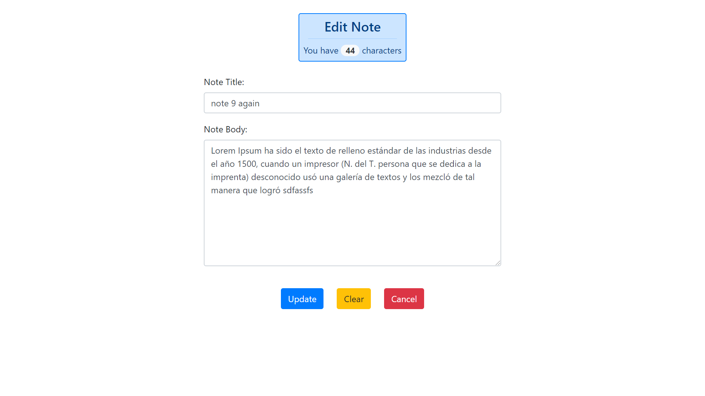
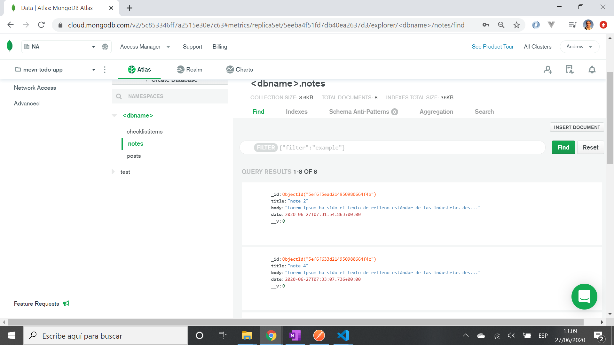
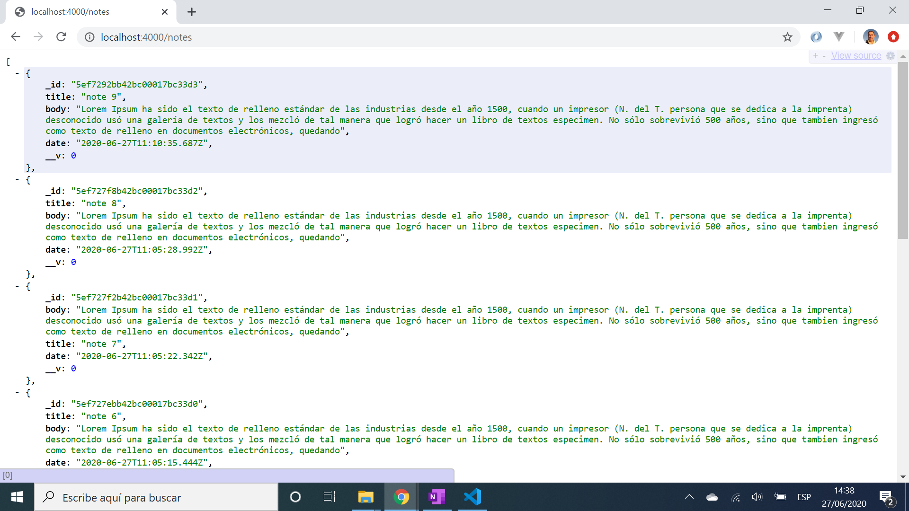
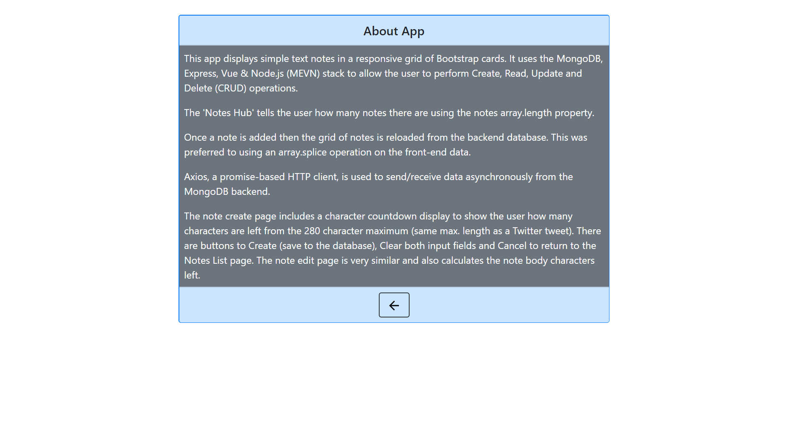

# :zap: MEVN Stack Notes

* This app displays simple text notes in a grid of Bootstrap cards.
* Uses the MongoDB, Express, Vue & Node.js (MEVN) stack to perform Create, Read, Update and Delete (CRUD) operations.

**Note:** to open web links in a new window use: _ctrl+click on link_

## :page_facing_up: Table of contents

* [:zap: MEVN Stack Notes](#zap-mevn-stack-notes)
  * [:page_facing_up: Table of contents](#page_facing_up-table-of-contents)
  * [:books: General info](#books-general-info)
  * [:camera: Screenshots](#camera-screenshots)
  * [:signal_strength: Technologies](#signal_strength-technologies)
  * [:floppy_disk: Setup](#floppy_disk-setup)
  * [:computer: Code Examples](#computer-code-examples)
  * [:cool: Features](#cool-features)
  * [:clipboard: Status & To-Do List](#clipboard-status--to-do-list)
  * [:clap: Inspiration](#clap-inspiration)
  * [:envelope: Contact](#envelope-contact)

## :books: General info

* Axios used to send/receive data from the MongoDB backend
* A responsive grid of notes is displayed on the Vue frontend using data-binding and a v-for loop. Once a note is added then the grid of notes is reloaded.
* There is an app info. page

## :camera: Screenshots








## :signal_strength: Technologies

**Frontend:**

* [Vue framework v2](https://vuejs.org/)
* [Vue Router v3](https://router.vuejs.org/) the official router for Vue.js
* [Vue CLI v4](https://cli.vuejs.org/)
* [Axios v0.21.0](https://github.com/axios/axios), a promise-based http client, used to consume API data.
* [vue-axios v3](https://www.npmjs.com/package/vue-axios) for integrating axios to Vuejs
* [Vue DevTools extension for Chrome](https://chrome.google.com/webstore/detail/vuejs-devtools/nhdogjmejiglipccpnnnanhbledajbpd)
* [Bootstrap v4](https://getbootstrap.com/) components and styles
* [Vue moment v4](https://github.com/brockpetrie/vue-moment#readme) to convert UTC date format
* [Material svg icons](https://material.io/resources/icons/?search=cale&icon=event_note&style=baseline)

**Backend:**

* [Express v4](https://expressjs.com/)
* [Mongoose v5](https://mongoosejs.com/)
* [cors v2](https://www.npmjs.com/package/cors) Cross Origin Resource Sharing Connect/Express middleware

## :floppy_disk: Setup

**/ Frontend:**

* `npm run lint` to lint files
* `npm run client` to run server. Navigate to `http://localhost:8080/`. The app will automatically reload if you change any of the source files.
* `npm run build` to create build file

**/api Backend:**

* `nodemon server.js` to run node.js server. Navigate to `http://localhost:4000/` to see JSON object with todos or an empty array (refresh after changes - does not auto-update). CRUD operations can be performed on this backend using the [Postman](https://www.postman.com/) API dev tool.

**/ Full stack:**

* `npm run dev` to run client and backend server concurrently. Navigate to `http://localhost:8080/` to see frontend and `http://localhost:4000/` to see backend (refresh after changes - does not auto-update).

## :computer: Code Examples

* `note.controllers.js` - add new note to database using POST

```javascript

exports.post_note = async (req, res) => {
  const newNote = new Note(req.body);
  try {
    const note = await newNote.save();
    if (!note) throw new Error("Error saving note item");
    res.status(200).json(note);
  } catch (error) {
    res.status(500).json({ message: error.message });
  }
};
```

## :cool: Features

* [Heroku deployment](https://mevn-stack-notes.herokuapp.com/) saves user notes using Heroku MongoDB database extension
* Heroku auto updates deployment when I commit code updates to Github
* In dev - Front and backends are run with one command using concurrently set up in package.json
* Display of card array is responsive so they wrap around nicely as screen size changes
* Simple 'Notes Hub' tells user how many notes there are and lets them navigate to the add note or app info pages
* note max title length set to 23 so it shows on 1 line in card
* note max content length set to 280, same as a twitter post
* backend code separates controller functions from routes
* Updating a note will automatically update the date so it goes to the front of the (date-sorted) notes list

## :clipboard: Status & To-Do List

* Status: Working. Deployed. Dependencies updated and no vulnerabilities
* To-Do: Nothing

## :clap: Inspiration

* [Vue CLI Configuration Reference](https://cli.vuejs.org/config/#devserver-proxy)
* [Medium article: Express JS— body-parser and why may not need it](https://medium.com/@mmajdanski/express-body-parser-and-why-may-not-need-it-335803cd048c)

## :envelope: Contact

* Repo created by [ABateman](https://www.andrewbateman.org) - you are welcome to [send me a message](https://andrewbateman.org/contact)
