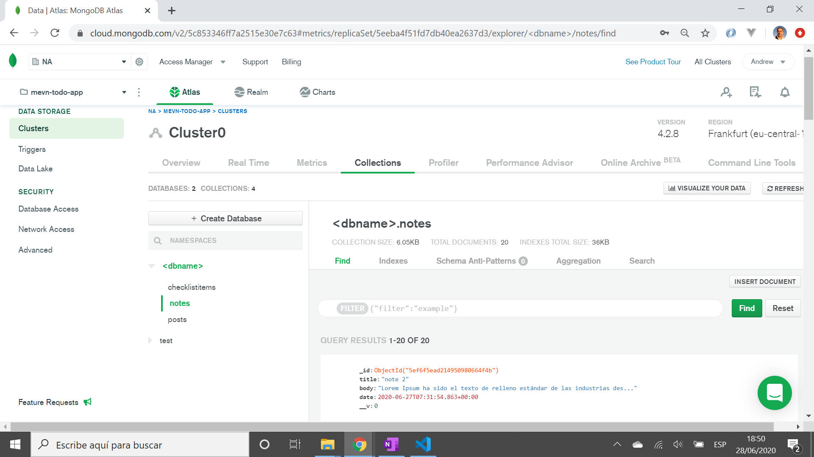

# :zap: MEVN Stack Notes

* Full stack app using MongoDB, Express, Vue and Node.js to perform Create, Read, Update and Delete (CRUD) operations on strings of data.

**Note:** to open web links in a new window use: _ctrl+click on link_

## :page_facing_up: Table of contents

* [:zap: MEVN Stack Notes](#zap-mevn-stack-notes)
	* [:page_facing_up: Table of contents](#page_facing_up-table-of-contents)
	* [:books: General info](#books-general-info)
	* [:camera: Screenshots](#camera-screenshots)
	* [:signal_strength: Technologies](#signal_strength-technologies)
	* [:floppy_disk: Setup](#floppy_disk-setup)
	* [:computer: Code Examples](#computer-code-examples)
	* [:cool: Features](#cool-features)
	* [:clipboard: Status & To-Do List](#clipboard-status--to-do-list)
	* [:clap: Inspiration](#clap-inspiration)
	* [:envelope: Contact](#envelope-contact)

## :books: General info

* Axios used to send/receive data from MongoDB backend
* A list of notes is displayed on a Vue frontend using data-binding and a v-for loop. Clicking on the + icon in the header alert box navigates to an add note page. Once note is added then list of notes is reloaded.

## :camera: Screenshots





## :signal_strength: Technologies

**Frontend:**

* [Vue framework v2](https://vuejs.org/)
* [Vue Router v3](https://router.vuejs.org/) the official router for Vue.js
* [Vue CLI v4](https://cli.vuejs.org/)
* [Axios v0.19.2](https://github.com/axios/axios), a promise-based http client, used to consume API data.
* [vue-axios](https://www.npmjs.com/package/vue-axios) for integrating axios to Vuejs
* [Vue DevTools extension for Chrome](https://chrome.google.com/webstore/detail/vuejs-devtools/nhdogjmejiglipccpnnnanhbledajbpd)
* [Bootstrap v4](https://getbootstrap.com/) components and styles
* [Vue moment](https://github.com/brockpetrie/vue-moment#readme) to convert UTC date format
* [Material svg icons](https://material.io/resources/icons/?search=cale&icon=event_note&style=baseline)

**Backend:**

* [Express v4](https://expressjs.com/)
* [Mongoose v5](https://mongoosejs.com/)
* [cors](https://www.npmjs.com/package/cors) Cross Origin Resource Sharing Connect/Express middleware
* [body parser](https://www.npmjs.com/package/body-parser) Node.js body parsing middleware

## :floppy_disk: Setup

**/ Frontend:**

* `npm run lint` to lint files
* `npm run client` to run server. Navigate to `http://localhost:8080/`. The app will automatically reload if you change any of the source files.
* `npm run build` to create build file

**/api Backend:**

* `nodemon server.js` to run node.js server. Navigate to `http://localhost:4000/` to see JSON object with todos or an empty array (refresh after changes - does not auto-update). CRUD operations can be performed on this backend using the [Postman](https://www.postman.com/) API dev tool.

**/ Full stack:**

* `npm run dev` to run client and backend server concurrently. Navigate to `http://localhost:8080/` to see frontend and `http://localhost:4000/` to see backend (refresh after changes - does not auto-update).

## :computer: Code Examples

* `note.controllers.js` - add new note to database using POST

```javascript

exports.post_note = async (req, res) => {
  const newNote = new Note(req.body);
  try {
    const note = await newNote.save();
    if (!note) throw new Error("Error saving note item");
    res.status(200).json(note);
  } catch (error) {
    res.status(500).json({ message: error.message });
  }
};
```

## :cool: Features

* Heroku deployment saves user notes using Heroku MongoDB database extension.
* In dev - Front and backends can be run with one command using concurrently set up in package.json
* Display of card array is responsive so they wrap around nicely as screen size changes
* [Deployed to Heroku](https://mevn-stack-notes.herokuapp.com/)
* Simple 'Notes Hub' Top display tells user how many notes there are in total
* backend code separates controller functions from routes

## :clipboard: Status & To-Do List

* Status: Working. Deployed.
* To-Do: add cancel button to edit vue. add max note title (40?) and body length (300?) etc. add characters remaining? Make sure all notes in line are same height. Add app info nav link

## :clap: Inspiration

* [Vue CLI Configuration Reference](https://cli.vuejs.org/config/#devserver-proxy)

## :envelope: Contact

* Repo created by [ABateman](https://www.andrewbateman.org) - you are welcome to [send me a message](https://andrewbateman.org/contact)
